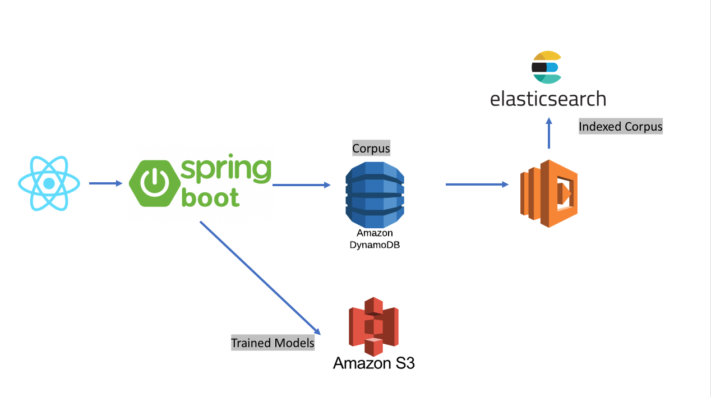

# Sesame Lab
Sesame Lab is an Natural Language Processing training website that allows users to collaborate 
over the web to tag documents for the purpose of training NLP algorithms

The server uses [OpenNLP](https://opennlp.apache.org/) as the backing algorithm provider. I may
consider using alternate providers or even entirely different language stacks (ex: NTLK) in the future

The central idea behind Sesame Lab is that tagging and cleaning corpus is the most arduous part of
NLP based model building. There are many domain specific concepts that the standard models don't cover.
For example: in the financial domain, issuer names, mutual fund families are often prominently featured
in textual data

# Architecture
A SPA (Single Page Application) written in React provide end user access. The Application Server
is written in Kotlin on Spring Boot 2.0.0

This separation of UI and Server enables a coherent access model between browser based and machine-to-machine
API calls

Training data (the corpus of documents) are stored in DynamoDB (could've used MongoDB or any Key Value store).
To keep the data searchable and answer inquiries such as "How many documents are in each  topic" we replicate
all corpus data to a search cluster (currently Elasticsearch)

The synchronization between DynamoDB and Elasticsearch is achieved using an Lambda, 
source code located [Here](https://github.com/erfangc/dynamodb-elasticsearch-replicator)

See architectural diagram below 
 

# Authentication & Authorization
This application is OIDC (OpenID Connect) compliant and uses OAuth 2.0 to authorize end users / APIs
to access its contents

I use [Auth0](https://auth0.com/) as the Authentication Service Provider. Access to the Spring Boot
server is only possible via a valid JWT token issued and signed by the proper Auth0 domain with 
this server being an entry in the `aud` claim. This is true for both human users accessing the application
via the React SPA as well as machine users using an API

There are no other way to access the server (no direct LDAP/AD authentication over Basic or cookie/sessions) 